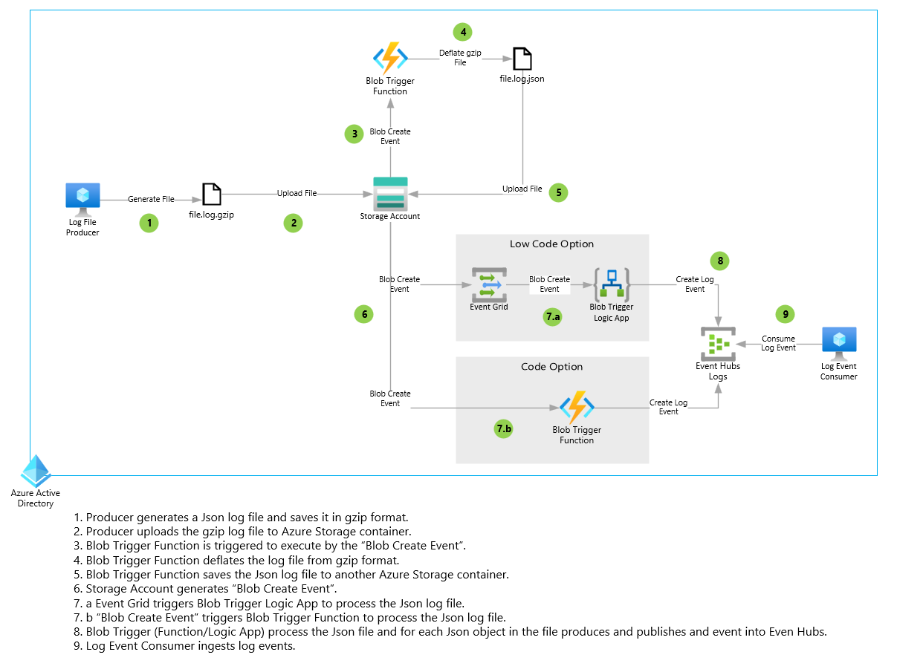

# Event Driven & Serverless Log Processor

This how-to guide focuses on building a serverless workflow set to monitor and then process Blob storage account events. In order to accomplish this, we are going to use the following Azure Service:

* Azure Blob Storage
* Azure Functions
* Azure Event Hubs
* Logic Apps
* Event Grid Connector for Logic App

## Process Flow

1. Producer generates a Json log file and saves it in gzip format.
2. Producer uploads the gzip log file to Azure Storage container.
3. Blob Trigger Function is triggered to execute by the “Blob Create Event”.
4. Blob Trigger Function deflates the log file from gzip format.
5. Blob Trigger Function saves the Json log file to another Azure Storage container.
6. Storage Account generates “Blob Create Event”.
7. a. Event Grid triggers Blob Trigger Logic App to process the Json log file. See this [repo](https://github.com/dcucereavii-ms/log-processing-with-logicapp/tree/main)for details.
   b. Blob Create Event” triggers Blob Trigger Function to process the Json log file.
8. Blob Trigger (Function/Logic App) process the Json file and for each Json object in the file produces and publishes and event into Even Hubs.
9. Log Event Consumer ingests log events.

## Solution Components

### Blob Trigger Azure Function

The Blob Trigger Azure Function is triggered by the **Blob Create Event.** It uses a native built in [Function Binding for storage](https://learn.microsoft.com/en-us/azure/azure-functions/functions-bindings-storage-blob?tabs=isolated-process%2Cextensionv5%2Cextensionv3&pivots=programming-language-python) to listen for the event.  The function also uses a built in [Output binding](https://learn.microsoft.com/en-us/azure/azure-functions/functions-bindings-storage-blob-output?tabs=python-v2%2Cisolated-process%2Cnodejs-v4&pivots=programming-language-python) to save the Json file to blob storage.

### Blob Processor Azure Function

The Blob Processor Azure Function us triggered by the **Blob Create Event**.  It uses a native buit in [Function Binding for storage](https://learn.microsoft.com/en-us/azure/azure-functions/functions-bindings-storage-blob-trigger?tabs=python-v2%2Cisolated-process%2Cnodejs-v4&pivots=programming-language-python) to listen for the event.  The function also uses a built in [Output binding](https://learn.microsoft.com/en-us/azure/azure-functions/functions-bindings-event-hubs-output?tabs=python-v2%2Cisolated-process%2Cnodejs-v4%2Cfunctionsv2%2Cextensionv5&pivots=programming-language-python) to write events to the Azure Event Hubs.

### Blob Process Logic App

Please see this [repo ](https://github.com/dcucereavii-ms/log-processing-with-logicapp/tree/main)for details.
